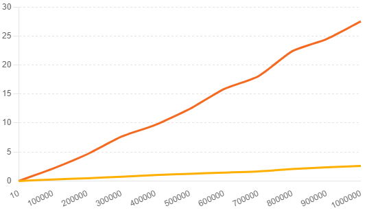

# AlgoForge

Classic data structures and graph algorithms hand-built in C — an augmented AVL tree, a binary min-heap with an empirical `buildHeap` benchmark, and Prim's & Dijkstra's algorithms on top of it.

## `avl-tree/` — Closest-pair AVL tree

A self-balancing AVL tree augmented so every node maintains the **closest pair of values** in its subtree, keeping closest-pair queries O(1) after any update. Insertion, deletion, rotations and augmentation maintenance implemented from scratch.

```bash
cd avl-tree
gcc -Wall closest_AVL_tree.c closest_AVL_tree_tester.c -o avl_tester
./avl_tester sample_input.txt
```

## `min-heap/` — Binary min-heap + buildHeap benchmark

An array-based min-heap (insert, extract-min, decrease-priority) with **two `buildHeap` strategies** — repeated insertion (O(n log n)) and bottom-up heapify (O(n)) — plus a timing harness that compares them empirically:



```bash
cd min-heap
make            # builds minheap_tester and minheap_measure
make run        # run the tester on sample_input.txt
./minheap_measure   # reproduce the benchmark numbers
```

## `graph-algorithms/` — Prim & Dijkstra

A weighted undirected graph with **Prim's minimum spanning tree** and **Dijkstra's shortest paths**, both driven by the min-heap as their priority queue.

```bash
cd graph-algorithms
make
./graph_tester sample_input.txt
```

## Credits

Interface headers and test drivers are adapted from educational starter materials by Akshay Arun Bapat, Anya Tafliovich and F. Estrada; all core implementations (AVL operations, heap operations, benchmark, Prim, Dijkstra) are my own.
